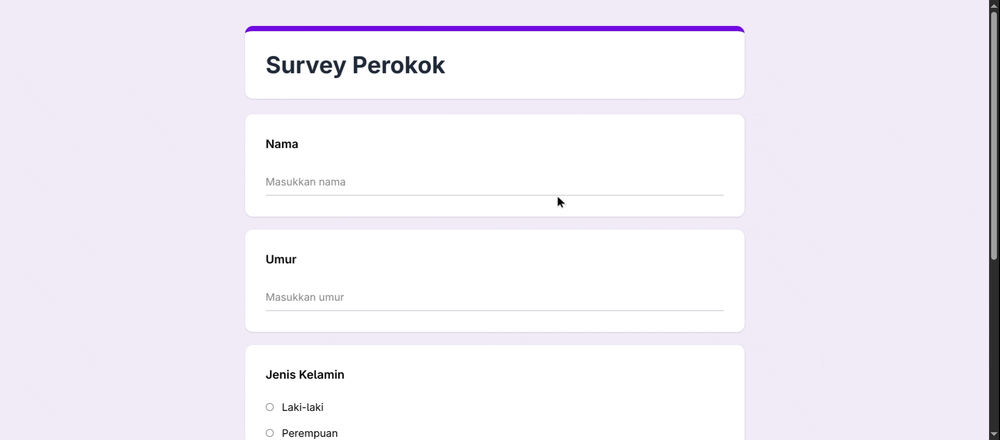

# Google Forms Survey Clone

A simple Google Forms-inspired survey application built with React. This project uses React Hook Form and Yup for form validation, while Redux Toolkit is used for global state management.

## Tech Stack

1. React
2. Vite
3. Tailwind CSS
4. React Hook Form
5. Yup
6. Redux Toolkit
7. React Redux
8. React Router DOM
9. React Icons

## Features

1. Submit survey responses
2. Form validation
3. View survey responses
4. Delete survey responses
5. Global state management with Redux Toolkit

## Preview

